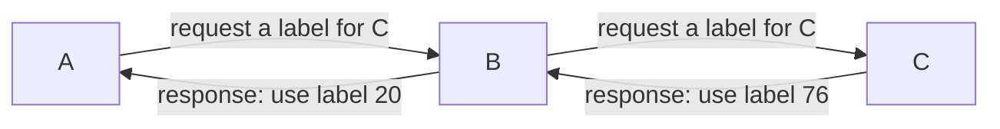

- between data-link and network layers
- used over IP to improve traffic management and QoS
- motivation: simplifies the forwarding process, improve traffic management and QoS
- shortcoming: less flexible and more overhead than IP alone; no multicast
# MPLS Routing Protocols
## LDP Label Distribution Protocol
Ingress A ⇒ Egress C

## RSVP-TE Resorce Reservation Protocol w/ Traffic Engineering
Why TE: find the shortest path _that has available bandwidth_
How: Each LSP has a bandwidth value, choose other LSP if bandwidth is low. Measurement of bandwidth value needs hardware support.
# LSP Label Switched Path

> LSP: a _predetermined_ and unidirectional tunnel between two routers; it is required for MPLS forwarding

**VC Virtual Circuits**: packet + circuit switching, it is LSP in the context of MLSP
IP Network ↔ MPLS routers(LER, LSRs, Egress node) ↔ IP Network
**LER Label edge router / Ingress node**: makes the initial path selection
**LSR Label switching router / Capable router / Transit node**: does MPLS switching in the middle of LSP  
forwards packets to the outgoing interface only based on label value (not IP)  
**Egress node**: the final router of an LSP, which removes the label
  
Backup paths: a predefined alternative route that network traffic can take in case the primary path fails  
Fast reroute: the mechanism to precompute and establish backup Label Switched Paths backup paths  
# Label Switching
**MPLS Labels**: 32 bits long (20 bits label value)
**MPLS Switching Table**: Incoming Label, Outgoing Label, Next Hop(an IP address), Outgoing Interface (port)
**Label Switching**:
The ingress node does the routing lookup just like before, but this is to determine the final router in the path, not the next hop.
The router applies a label based on this information. It learns the outgoing label and next hop from the switching table. Next router applies the outgoing label to route the traffic. No additional IP lookups.
At the egress node, the label is removed.