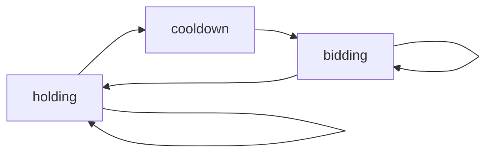

相比于暴力解法优化在于：数据结构上的同一节点不同状态的计算会引用共同的值，暴力解法重复计算了这些可以复用的值
相比于暴力解法做了什么：FSM DP将状态转化的逻辑放在每个节点的内部处理，而不是遍历逻辑上
# Array FSM
**Finite State Machine DP**: maintains a dp array for each state
Leetcode 121 122 123 188 309 714 19
## 309

```Python
def maxProfit309(self, prices: List[int]) -> int:
		numOfDays = len(prices)
		# start with bidding
		endWithBidding = [0]
		# float("-inf") is a hardcoded way to say this is an impossible situation
		endWithCooldown = [float("-inf")]
		endWithHolding = [-prices[0]]
		for i in range(1, numOfDays):
		    endWithBidding.append(max(endWithBidding[i - 1], endWithCooldown[i - 1]))
		    endWithHolding.append(max(endWithBidding[i - 1] - prices[i], endWithHolding[i - 1]))
		    endWithCooldown.append(endWithHolding[i - 1] + prices[i])
		return max(endWithBidding[-1], endWithCooldown[-1])
```
# Tree FSM
```python
# Naive solution
def rob(self, root: Optional[TreeNode]) -> int:
	def DFS(node, selectable):
		if node == None:
			return 0
		if selectable:
			return max(DFS(node.left, True) + DFS(node.right, True),  DFS(node.left, False) + DFS(node.right, False) + node.val)
		else:
			return DFS(node.left, True) + DFS(node.right, True)
	return DFS(root, True)

# Tree DP
def rob(self, root: Optional[TreeNode]) -> int:
	def DFS(node):
		# return value (dp0, dp1):
		# dp0: best gain from not selecting current node
		# dp1: best gain from selecting current nod
		if node == None:
			return [0, 0]
		ldp0, ldp1 = DFS(node.left)
		rdp0, rdp1 = DFS(node.right)
		return [max(ldp1, ldp0) + max(rdp1, rdp0), ldp0 + rdp0 + node.val]
	return max(DFS(root))
```