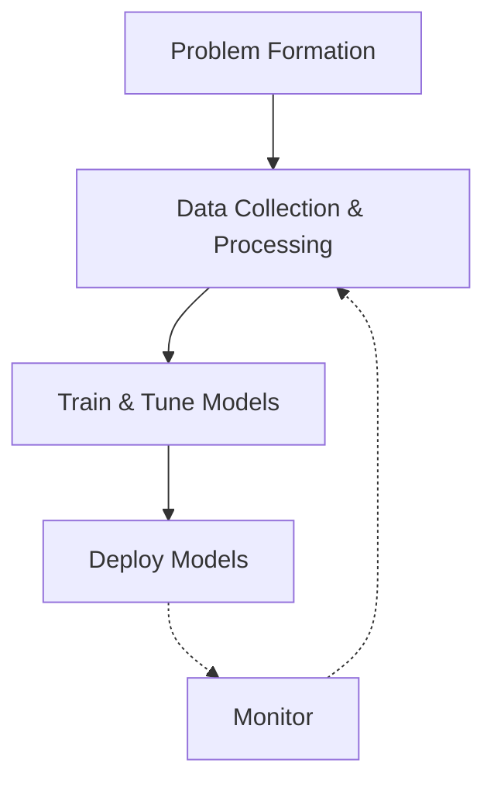

> Human written program: input -->|program| output  
> **Machine Learning**: Input data, Output -->|ML algorithm| program
# ML Workflow

# Terms
**categorical data:** discrete data  
**numerical data:** continuous data
**label**: the output
**Hyperparameter**: as opposed to parameters which are learnt by machine, hypermeters are set by human beings

**training/empirical error**: error on training data
**generalization error**: error on test data
**underfitting**: the model is too simple that it predicts poorly on both test and training data.  
**overfitting**: the model is too specific to the training data that it predicts poorly on test data.
**Regularization**: put some restraint on training models to avoid overfitting by assuming a prior knowledge that the weight follows a certain distribution
	[[Regularization]]
# Types of Learning
**[[Supervised Learning]]**: labelled input and output training data; we know the answer when learning given a training sample
**[[Unsupervised Learning]]**: unlabeled or raw data; we don’t know the answer when learning given a training sample
**Semi-supervised Learning**: some of the data is labelled (we cannot only afford labelling all the data)

**Offline Learning**: static dataset, models do not interact with the task environment
**Online Learning**: dynamic data stream, models incrementally updates to adapt to new changes
**[[Reinforcement Learning]]**: Labels are not explicitly given but a series of reinforcement signals (rewards or punishments) are provided during learning
	On Policy & Off Policy

**Deep Learning**: ML that uses DNN
	[[Deep Neural Network DNN]]
**Transformer**: [[Transformer]]