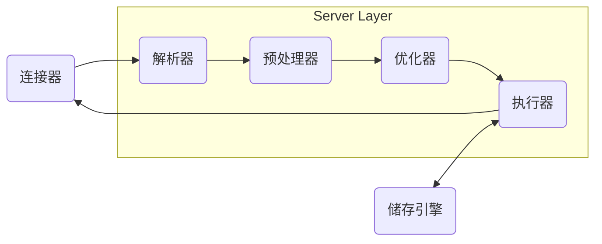

# 引擎
Mysql的MyISAM引擎和InnoDB引擎:
	在执行数据库写入的操作的时候，mysiam表会锁表，而innoDB表会锁行
MyISAM不支持外键，而InnoDB类型支持
MyISAM不支持事务处理等高级处理，而InnoDB类型支持
# 语句执行
## Server层


**连接器**
```bash
mysql -h$ip -u$user -p
```
**解析器**： 词法分析，语法分析，生成语法树
**预处理器**： 检查字段是否存在，将扩展成所有列
**优化器**：确定执行方案，用哪个索引等
	在查询语句前加`explain`来获知执行方案
==**执行器**：调用储存引擎层API，返回记录给连接器==
## 储存引擎层
	最流行的引擎：InnoDB