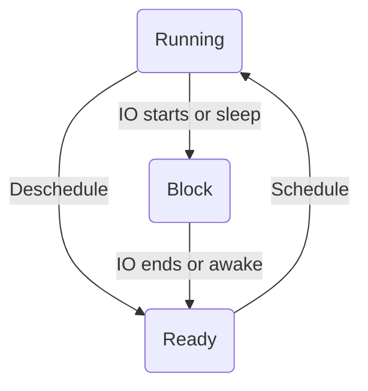

**Process**: a running program
	The core is always running, when no process need the core, the core runs an **system idle process**.
**User Process 用户进程**：用户通过终端加载的进程
**Daemon 守护进程**： 与终端无关的系统进程，基于时间或事件启动
# Abstraction
- **Machine State**: at any time, a process can be described by its machine state, which contains:
    **memory** (address space)
    **registers**: Program Counter PC / Instruction Pointer IP, Stack Pointer, Frame Pointer, etc
    **I/O information**
- Process API
    - Create: create a new process
    - Destroy: destroy an existing process _forcefully_
    - Wait: pause a process
    - Miscellaneous Control: other control methods
    - Status: get status information about a process
- Process States
    Running, Ready, Blocked(, Initial, Final/Zombie)
    (reasons to block: I/O, explicit sleep)

- Process Creation
    1. load: load codes and static data from **disk** to **memory**
    2. allocate memory for the program’s **run-time stack (**local variables, function parameters, and return addresses**)**
    3. allocate memory for the program’s **heap (**explicitly requested dynamically-allocated data**)**
    4. Other initialization as related to I/O
# Processes in Unix
**Process Identifier** PID
All processes have a parent process except for the **initial process**(PID=1).
**Orphan process**: a child process whose parent has terminated
	The new parent usually will be the **initial process**
**Zombie process**: a process that has exited but stills has a **PCB** in the **process table**
	a child exits and parent has not called wait() to get its exit status; if parent terminates without waiting for the exit code of the child, initial process would take care of that.
	This is because the exit status is stored by the kernel-side data structure. and the kernel cannot free it until it knows no one needs the exit code.
# PCB Process Control Block
> PCBs are the entries of the process table.

Each PCB stores the context of a process:
	Process description: name, process status, reason why it is blocked if any...
	Resources used: CPU time, memory, IO devices...
	Files opened: file descriptors, open mode, file type...
	Processor statuses: general-purpose registers, program counter PC, user stack pointer