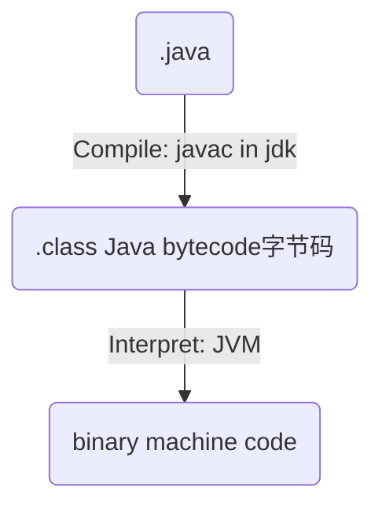

# Background
> Made by Oracle

JDK Java development kit: JRE + Devtools (javac, jheap, jconsole…)
	JRE Java runtime environment: JVM + Java Class Library
		JVM Java virtual machine: all compiled java bytecode should run here

# Grammar Cheat Sheet
## Data Types:
### Basic Types
`byte`、`short`、`int`、`long`
`float`、`double`
`char`
`boolean`
```Java
Integer.MAX_VALUE
```
### Reference Types:
Class, Interface, Array
### Boxing & Unboxing
- **装箱**：将基本数据类型转换为包装类型Wrapper Classes（Byte、Short、Integer、Long、Float、Double、Character、Boolean）。
- **拆箱**：将包装类型转换为基本数据类型。
## Function
### Main
```java
public class Main {
  public static void main(String[] args) {
    System.out.println("Hello World");
  }
}
```
## Lambda
Java内部函数是按引用捕获的，但是捕获后这些值被设置了final关键词，因此想改变这些值需要以下方法：
```Java
int[] cnt = {0};
Function<String, Void> addCount = (String input) -> {
	System.out.println(input);
	cnt[0]++;
	return null;
}
addCount.apply("Hello World");
```
## Control flow
```java
for (int i = 0; i < cars.length; i++)
for (String i : cars)
```
## Keywords
### final
final variables: values inside the variables cannot be changed once it has been initialized
final methods: methods cannot be overridden by a subclass
final classes: classes cannot be extended by a subclass
### static
static variables (only in class level): variables shared by all the instances of the class
static methods: methods that doesn’t need to access `this`, `super` and non-static members of the outer class
static classes (only nested classes): classes that doesn’t need to access non-static members of the outer class
# More
[[Java Data Structures]]
[[Grammar by Algo]]