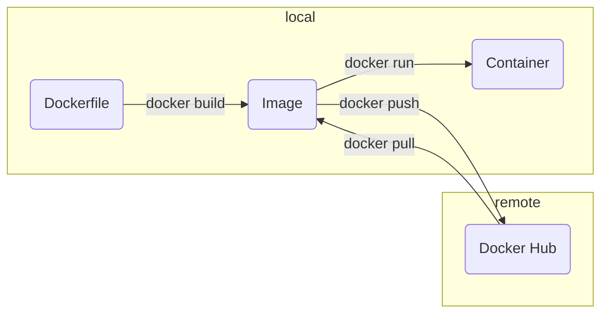

**Image:** a read-only templates containing instructions for creating a container. A Docker image creates containers to run on the Docker platform.
**Container:** an isolated place where an application runs without affecting the rest of the system and without the system impacting the application.
# Basic Command


```Shell
docker pull <image>
docker images # show all images
	-q
docker rmi <image>
docker run <options> <image> <command> <arguments>
	e.g. docker run ubuntu sleep 5
	--name
	--rm
		automatically removes container when exits
	--entrypoint sh
		override entrypoint with sh
	-d detach
	-i interactive
	-t sudo terminal
	-p 88:5000
		port mapping: mappning from port 5000 of container to localhost port 88
	-v /opt/datadir:/var/lib/mysql
		volume mapping: mapping from path of container "mysql" to local path "datadir"
	-w /path/to/workingdir
	-e APP_COLOR=blue
		environment variable

docker ps # show all containers
	-a -q
docker inspect <container_name_or_id>
docker start <container_name_or_id>
docker stop <container_name_or_id>
docker restart <container_name_or_id>
docker rm <container_name_or_id>
docker logs <container_name_or_id>

docker attach <container_name_or_id> # 回到容器主进程，不需要-it，因为已经在docker run时声明了
docker exec -it <container_name_or_id> <command to execute in container environment> # 创建新的进程
	docker exec -it <container_name_or_id> /bin/bash
	docker exec -it <container_name_or_id> /bin/sh

docker cp <container_name_or_id>:/path/filename.txt ~/Desktop/filename.txt
	docker cp src dest
docker system prune 
	Remove all unused containers, networks, images (both dangling and unreferenced), and optionally, volumes.
```
# Configurations
## Dockerfile + .dockerignore: build an image
Dockerfile:
```Dockerfile
FROM node:18-alpine3.15
WORKDIR /src
COPY package.json .
# With some overhead we can use ADD, which support auto unzip and downloading from the internet
RUN npm install
COPY . .

# mandatory starting command
ENTRYPOINT ["echo"]
# ENTRYPOINT can still be overwritten: docker run --entrypoint ls myimage

# default starting command
CMD ["npm", "run", "dev"]
# use default CMD: docker run myimage
# overwrite CMD: docker run myimage ls

# NB: When Both ENTRYPOINT and CMD are present, CMD will be passed as parameters to ENTRYPOINT
```
.dockerignore:
```
Dockerfile
.dockerignore
.git
.gitignore
node_modules
```
## docker-compose.yml: run a container from the image
```yml
version: "3.8"
services:
	<container-name>:
		# the location of Dockerfile
		build: .
		ports:
			- 3000:3000
		volumes:
			# :ro readonly container change won't affect local files
			- /local/path:/container/path:ro
			- /files/that/wont/change/containters
```
### `docker-compose up`=`docker build`+`docker run`
`docker-compose up -d --build`
- `-d` detach mode
- `—build` update image if any change in the image instead of using the cache before

### `docker-compose run`
`docker-compose up` starts all services, `run` starts a single service in the foreground by default.

`docker-compose run --service-ports <service_name> sh`
- `--service-ports` flag makes `docker-compose` publish ports defined in the service configuration to the host, similar to how `docker-compose up` does. This is necessary if you intend to access your application's ports from the host machine.
- `sh` is the command you want to run in the container; in this case, it starts the shell.
### `docker-compose down`
shut down the containers
# Useful Commands & Aliases
```
clear containers: docker rm $(docker ps -aq -f status=exited)

alias dcbuild='docker-compose build'
alias dcup='docker-compose up'
alias dcdown='docker-compose down'
alias dockps='docker ps --format "{{.ID}}  {{.Names}}" | sort -k 2'
docksh() { docker exec -it $1 /bin/bash; }
```