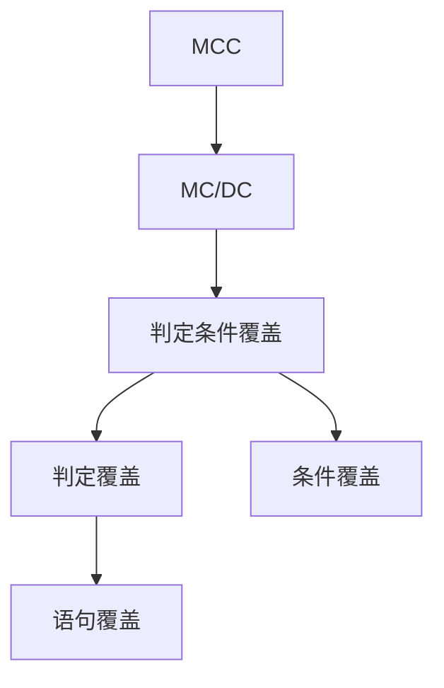

**Test Oracle**：用于判断测试结果是否正确的机制或标准。
**白盒/黑盒**：实现可见/不可见
# 黑盒取值覆盖
## 取值代表性
等价类划分（Equivalence Class Partitioning, 简称 ECP）：把所有可能的输入划分为若干“等价类”，每个类中只选一个代表来测试
	有效等价类(合法、程序应接受的输入)，无效等价类(非法、程序应拒绝的输入)
边界值分析（Boundary Value Analysis）：边界值，刚刚大/小于边界值的数值
## 多取值组合
>注意：无效值不组合，且考虑因素间约束条件。

Each Choice: 每个测试因子的每个取值至少出现一次
Basic Choice: 以基础组合为基础，每次修改一个测试因子的取值，直到全部覆盖
N-wise: 从全部M个测试因子中取N个($C(M, N)$次)，对他们的取值进行组合，其他测试因子数值不变
	pair-wise(N=2) 比较常用
All Combinations: 覆盖全部可能组合

判定表Decision table
	分析需求，形成一张纵轴为条件和结果，横轴为取值的表
	根据结果，将横轴取值做一些合并
# 白盒逻辑覆盖
语句覆盖：可执行语句在测试中被执行至少一次
判定覆盖/分支覆盖：分支判断的真假值被执行至少一次
条件覆盖：分支判断中的每个条件的真假值被执行至少一次
判定条件覆盖：条件覆盖+判定覆盖
条件组合覆盖(Multiple Condition Coverage, MCC)：分支判断内所有条件的真值组合都被执行至少一次
MC/DC(Modified Condition / Decision Coverage)覆盖：条件-判定覆盖+存在一对测试用例，仅改变一个条件，便可以使判定结果改变（比MCC实用）

**概念包含图**

路径覆盖：程序运行的所有路径至少被执行一次
	**路径**：两个**判定点**之间的连接
	一个判定点的**路径组合**：该判定点的所有**出入路径**的组合
	**路径覆盖深度N**：N条连续路径的路径组合
	以尽少的用例覆盖从头到尾所有深度为N的路径组合
N-switch覆盖：
	1. 找出系统状态迁移机
	2. 覆盖状态图中所有N+1次连续状态转换的序列